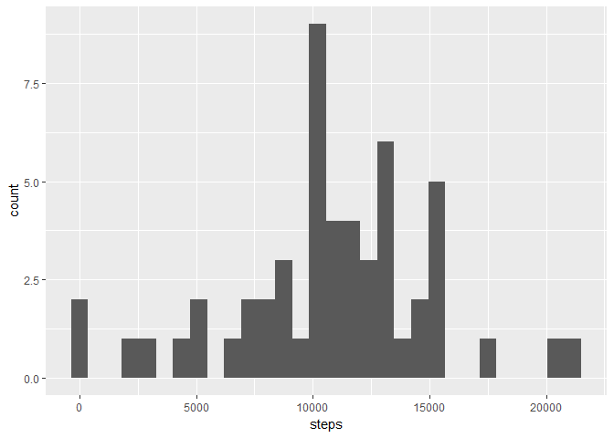

PA1 Template
------------

### Loading Data

    activity<-read.csv("activity.csv")
    library(dplyr)
    library(ggplot2)

    complete<-na.omit(activity)

    act.day <- group_by(complete, date)
    act.day <- summarize(act.day, steps=sum(steps))

    qplot(steps, data=act.day)

    ## `stat_bin()` using `bins = 30`. Pick better value with `binwidth`.

    mean(act.day$steps)

    ## [1] 10766.19

    median(act.day$steps)

    ## [1] 10765

    act.int <- group_by(complete, interval)
    act.int <- summarize(act.int, steps=mean(steps))

    ggplot(act.int, aes(interval, steps)) + geom_line()

    act.int[act.int$steps==max(act.int$steps),]

    ## # A tibble: 1 × 2
    ##   interval    steps
    ##      <int>    <dbl>
    ## 1      835 206.1698

    sum(is.na(activity))

    ## [1] 2304

    names(act.int)[2] <- "mean.steps"
    act.impute <- merge(activity, act.int)

    act.impute$steps[is.na(act.impute$steps)] <- act.impute$mean.steps[is.na(act.impute$steps)]

    act.day.imp <- group_by(act.impute, date)
    act.day.imp <- summarize(act.day.imp, steps=sum(steps))

    hist(act.day.imp$steps)

    mean(act.day.imp$steps)

    ## [1] 10766.19

    median(act.day.imp$steps)

    ## [1] 10766.19

    act.impute$dayofweek <- weekdays(as.Date(act.impute$date))
    act.impute$weekend <-as.factor(act.impute$dayofweek=="Saturday"|act.impute$dayofweek=="Sunday")
    levels(act.impute$weekend) <- c("Weekday", "Weekend")

    act.weekday <- act.impute[act.impute$weekend=="Weekday",]
    act.weekend <- act.impute[act.impute$weekend=="Weekend",]

    act.int.weekday <- group_by(act.weekday, interval)
    act.int.weekday <- summarize(act.int.weekday, steps=mean(steps))
    act.int.weekday$weekend <- "Weekday"
    act.int.weekend <- group_by(act.weekend, interval)
    act.int.weekend <- summarize(act.int.weekend, steps=mean(steps))
    act.int.weekend$weekend <- "Weekend"

    act.int <- rbind(act.int.weekday, act.int.weekend)
    act.int$weekend <- as.factor(act.int$weekend)
    ggplot(act.int, aes(interval, steps)) + geom_line() + facet_grid(weekend ~ .)

